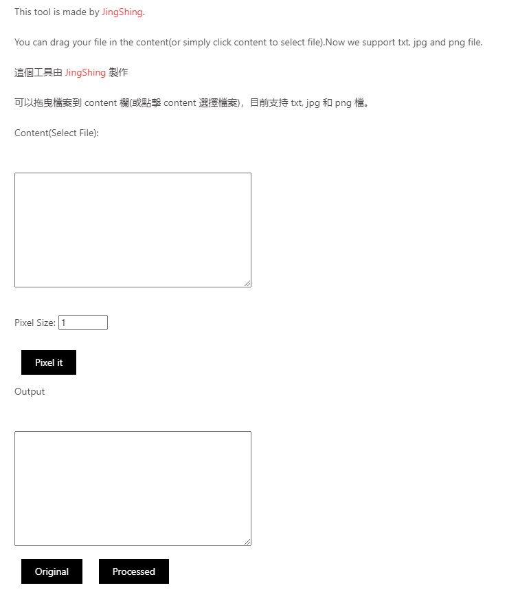

English | [繁體中文](README_TCH.md)

# [Online Tool](https://jingshing.com/pixel_filter_js/)
You can use this tool on [my website](https://jingshing.com/pixel_filter_js/).

# Pixel_Filter_JS
A pixel filter made with Javascript.

This is rewrite from my old repo [Pixel_Art_filter](https://github.com/JingShing/Pixel-Art-Filter-Web).

You can put the content you want to pixelize in content filed.

Then click button it will pixelize the file for you.

# UI

# Example
## Before Pixelize

## After 10 pixel size Pixelize

# Log
## Ver0.1
* Feature:
  * Core part: pixel size
  * file load
  * file drag and drop
  * Now support txt, png and jpg
## Ver0.2
* Feature:
  * Now can see before and after image
