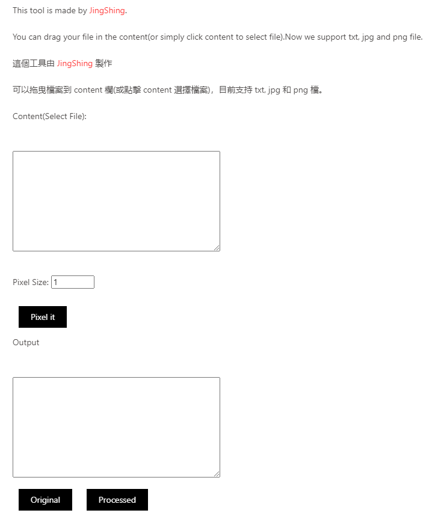

[English](README.md) | 繁體中文

# [Online Tool](https://jingshing.com/pixel_filter_js/)
你可以在 [我的網站使用這個工具](https://jingshing.com/pixel_filter_js/)。

# Pixel_Filter_JS
一個透過 Javascript 製作的像素濾鏡工具。

這個專案重構於我的 [像素濾鏡工具](https://github.com/JingShing/Pixel-Art-Filter-Web).

你可以將想要像素化的檔案放入 content 區。

調整好數值後。點擊按鈕，將自動像素化檔案。

# UI介面

# Example範例
## 像素化前
![image/pixel_B.png]
## 經歷 10 pixel 大小的像素化後
![image/pixel_A.png]

# Log紀錄
## Ver0.1
* 功能:
  * 核心: 像素顆粒大小
  * 檔案讀取
  * 檔案拖曳
  * 目前支持 txt, png 和 jpg
## Ver0.2
* 功能:
  * 目前可以透過按鈕分別顯示原本圖片和處理後的圖片
